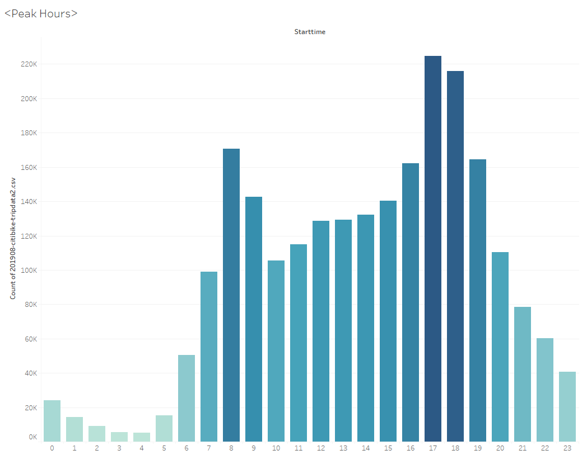

# Bikesharing Analysis

## Dashboard Links
[Citibike Story](https://public.tableau.com/shared/CT9BGNDHJ?:display_count=n&:origin=viz_share_link)  
[Citibike Dashboard](https://public.tableau.com/app/profile/andy.mauvais/viz/NYCCitiBiki/NYCStory)  

### Overview of the analysis: Explain the purpose of this analysis.
In this analysis, I visualize key data from a New York Citi Bike dataset.   
These visualizations will be used to predict if a bike-share company idea could work in Des Moines.  

- Using public Citi Bike data for the analysis.
  - https://ride.citibikenyc.com/system-data 
  - https://s3.amazonaws.com/tripdata/index.html
  - 201908-citibike-tripdata.csv.zip 
  - https://s3.amazonaws.com/tripdata/201908-citibike-tripdata.csv.zip 
This zip file contains all the August 2019 data  
Using data from August because there is likely more traffic during the summer months.  

### Results: Using the visualizations you have in your Tableau Story, describe the results of each visualization underneath the image.
Peak Hours:

Shows which part of day the most bikes are needed (5:00pm - 7:00pm).

How long bikes are checked out for all riders and genders.
How many trips are taken by the hour for each day of the week, for all riders and genders.
A breakdown of what days of the week a user might be more likely to check out a bike, by type of user and gender.

Number of rides by gender. 
What can the data tell us about the riders themselves? Often, the first place we start when understanding a population is gender. 

### Summary: Provide a high-level summary of the results and two additional visualizations that you would perform with the given dataset.

Summary:

There is a high-level summary of the results and two additional visualizations are suggested for future analysis (5 pt)
Links to images are working and displayed correctly. (2 pt)
There are at least seven visualizations for the NYC Citibike analysis (7 pt)
There is a description of the results for each visualization (7 pt)

