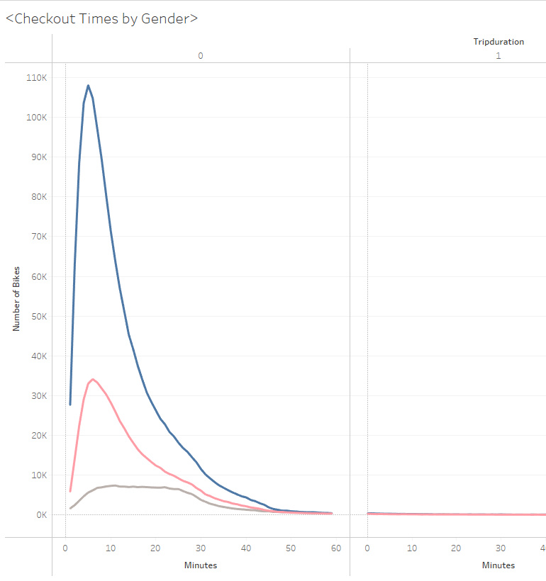
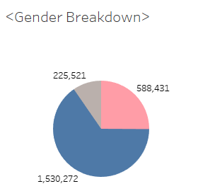
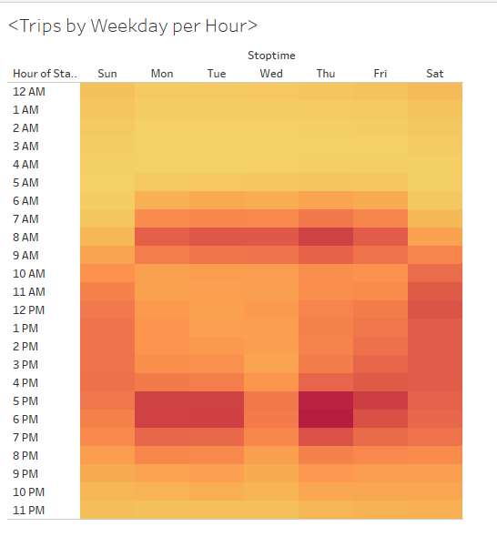
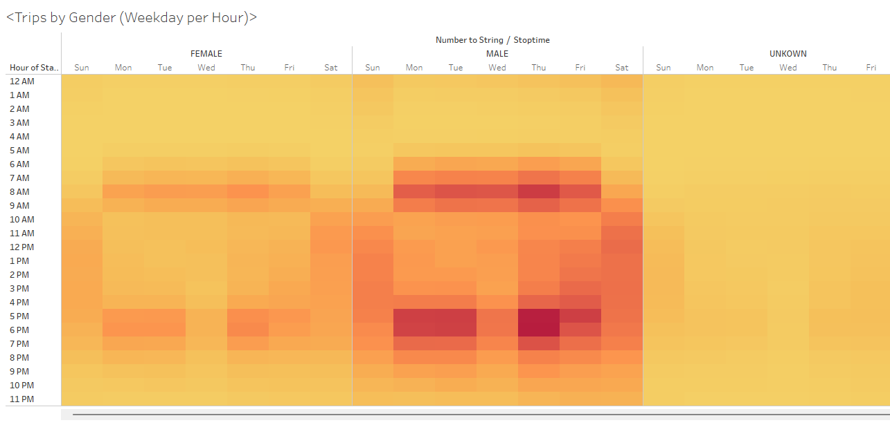
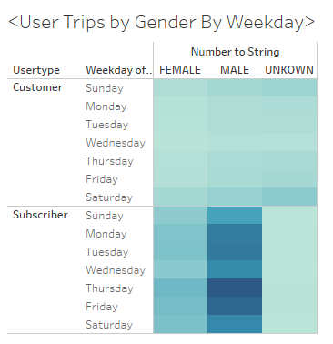

# Bikesharing Analysis

## Dashboard Links
[Citibike Story](https://public.tableau.com/shared/CT9BGNDHJ?:display_count=n&:origin=viz_share_link)  
[Citibike Dashboard](https://public.tableau.com/app/profile/andy.mauvais/viz/NYCCitiBiki/NYCStory)  

### Overview of the analysis:  
In this analysis, I visualize key data from a New York Citi Bike dataset.   
These visualizations will be used to predict if a bike-share company idea could work in Des Moines.  

- Using public Citi Bike data for the analysi:
  - https://ride.citibikenyc.com/system-data 
  - https://s3.amazonaws.com/tripdata/index.html
  - https://s3.amazonaws.com/tripdata/201908-citibike-tripdata.csv.zip    
The zip file contains all the August 2019 data  
Using data from August because there is likely more traffic during the summer months.  

### Results:  
#### Peak Hours

The visulaization shows which part of day the most bikes are needed.  
According to the NYC data, the busiest times are between 5:00pm and 7:00pm.  

#### Checkout Times

Most bikes are checked out and used for under an hour.

#### Gender Breakdown  

Around 65% of ridership is made of males; 25% of ridership are female.

#### Number of Trips by Weekday  

During weekdays, mornings and evenings have high activity.  
Meanwhile, on the weekend, afternoon times have medium activity.

#### User Trips by Gender  

The number of customers is fairly equal between genders.  
However, subscribers are mainly composed of men, then female, and lastly unkown/other.  
Thursday and Friday are shown to be high activity days, mainly composed of male subscribers.  

### Summary: Provide a high-level summary of the results and two additional visualizations that you would perform with the given dataset.
The NYC Citibike data shows that a bikesharing company's attention needs to be targeted towards the high activity levels around the 8:00am morning time and the 6:00pm evening time. While Thursdays are shown to be a day with high activity in NYC, this may not apply to other cities such as Des Moines, Iowa. Thus, it is best to be prepared each weekday. It is also likely that most of the bikesharing companies customers and subscribers will be composed of men.  
Additional visualizations that can help the bikesharing company:  
 - A graph showing the count of ages of the customers
 - A chart showing the difference in trip duration between customers against subscribers.  
